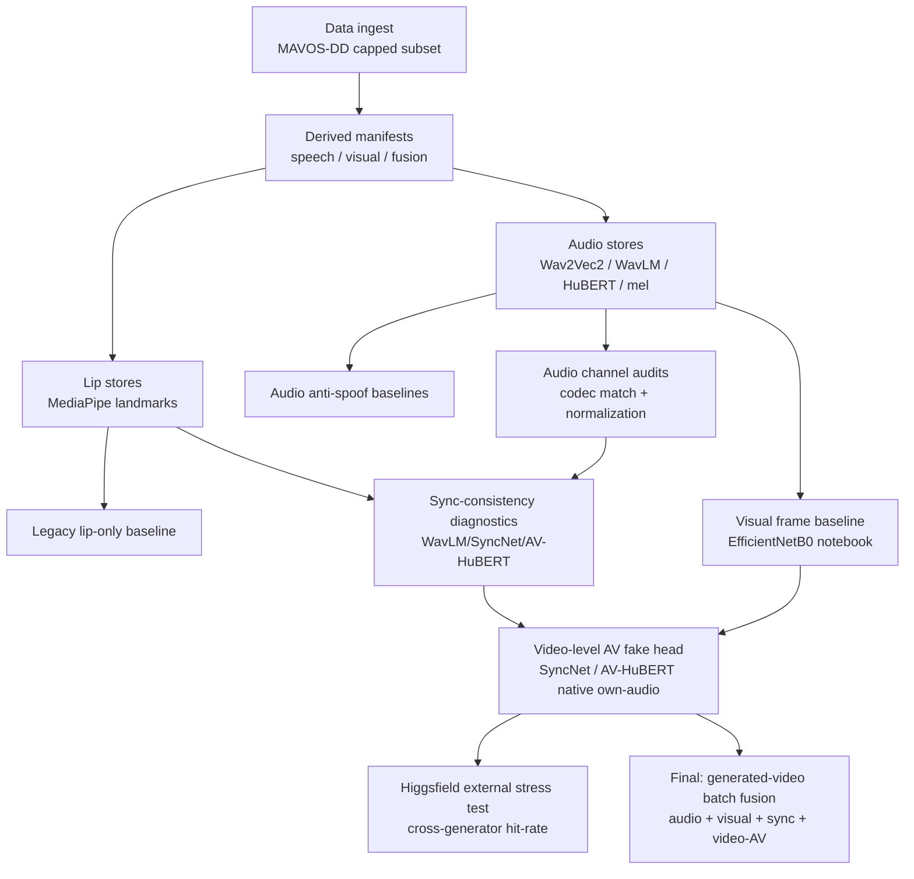

# Audiovisual Deepfake Detection

Multimodal deepfake detection on a capped MAVOS-DD subset. The project keeps
four related tasks separate instead of pretending they are one:

| Task | Question | Positive class |
|---|---|---|
| Audio anti-spoof | Is the speech audio generated? | ElevenLabs / Google / OpenAI / other TTS |
| Visual fake-video | Is the face/video generated? | EchoMimic / MEMO / LivePortrait / Sonic |
| Audio-visual sync (diagnostic) | Does the mouth motion match the audio? | Async / inconsistent pair |
| Video-level AV fake (corrected final) | Is this a fake video, given its native audio? | EchoMimic / MEMO / LivePortrait / Sonic with own audio |

The final detector should combine explicit head scores as separate signals:

```text
deepfake_score = fusion(audio_fake_score, visual_fake_score, av_inconsistent_score, video_av_fake_score)
```

**Why the video-level AV head is separate from AV sync.** The AV-sync head
learns to say "matched" when a video is paired with its own audio and
"mismatched" when audio is swapped in. That is fine as a diagnostic, but it is
the wrong final objective: EchoMimic/MEMO/Sonic/LivePortrait clips with their
*own* generated video and *own* original audio are still fake videos, and any
final detector must flag them as positive. The video-level AV head labels
`real=0` and `echomimic/memo/sonic/liveportrait=1` regardless of whether the
audio is the video's native track, so it does not inherit the AV-sync task's
"same audio ⇒ negative" bias.

Implementation details and the full working memory live in
[`CLAUDE.md`](CLAUDE.md). This README keeps only the public repro commands,
headline metrics, and current roadmap.

## Roadmap Snapshot



## Quick Start

Python 3.10 virtual environment.

macOS / Linux:

```bash
python3.10 -m venv .venv
source .venv/bin/activate
pip install -r requirements.txt
```

Windows PowerShell:

```powershell
py -3.10 -m venv .venv
.\.venv\Scripts\Activate.ps1
python -m pip install -r requirements.txt
```

Smoke-test the model module:

```bash
python -m src.models.late_fusion
```

## Repro Commands

Each step writes gitignored artifacts under `data/`. Pass `--help` to any
module for full flags. The fetch is deterministic for a fixed MAVOS-DD
repository state; cap changes are picked up from `src.common.CAPS` and the
downloader is idempotent on re-runs.

1. **Fetch the MAVOS-DD subset.**

   ```bash
   python -m src.data.download_subset
   python -m src.data.download_subset --validate    # expect VALIDATION OK
   ```

2. **Freeze splits and extract features** (70/15/15 stratified on
   `source_folder`, seed 42; one `.npy` per video for audio, one `.npz`
   for lips).

   ```bash
   python -m src.data.make_splits
   python -m src.features.extract_audio
   python -m src.features.extract_lips
   ```

3. **Transcribe bonafide WAVs** (optional, prerequisite for TTS spoof
   generation). Requires `GOOGLE_APPLICATION_CREDENTIALS` and
   `GOOGLE_CLOUD_PROJECT` in `.env`.

   ```bash
   python scripts/export_wav.py
   python scripts/transcribe_google_stt_v2.py
   ```

4. **Generate spoof audio** from those transcripts. Each script supports
   `--estimate-only` (character count, no spend) and `--limit N` (smoke
   run). Outputs land under `data/tts_audio/`.

   | Engine             | Script                                                | Notes                                  |
   |--------------------|-------------------------------------------------------|----------------------------------------|
   | ElevenLabs TTS     | `scripts/synthesize_tts_from_transcripts.py`           | Text → speech, paid API                |
   | ElevenLabs STS     | `scripts/convert_real_speech_elevenlabs.py`            | Speech → speech (preserves prosody)    |
   | Google Neural2 TTS | `scripts/synthesize_google_tts_from_transcripts.py`    | Paid API; default voice rotation       |
   | Coqui XTTS-v2      | `scripts/synthesize_coqui_xtts_from_transcripts.py`    | Local, free                            |
   | OpenAI TTS         | `scripts/synthesize_openai_tts_from_transcripts.py`    | Paid API                               |

5. **Build derived manifests** (`audio_spoof`, `visual_speech`,
   `fusion_speech`).

   ```bash
   python -m src.data.build_speech_manifests
   ```

## Anti-Leakage And Audio Audits

Two hard label leaks surfaced during the mel-CNN baseline (PR #7) and were
fixed in place: codec footprint and voice overlap. Training and evaluation
default to the codec-matched + voice-disjoint inputs; the original leaky
embeddings/splits remain on disk but are unused by the merged baselines.

**Codec footprint match.** Bonafide rows are clean 16 kHz PCM WAV; every
TTS spoof row is lossy MP3 (ElevenLabs 44.1 kHz / 128 kbps, Google TTS
24 kHz / 64 kbps). That 100 % format/label correlation lets any mel-input
model shortcut to a WAV-vs-MP3 detector. Fix: round-trip every bonafide
through MP3 (codec spec sampled per row from the spoof distribution) and
decode all rows back to 16 kHz mono WAV, so codec history becomes
label-independent. Requires `ffmpeg` + `libmp3lame` on PATH.

```bash
python -m src.data.codec_match_audio                    # writes data/audio_wav_codec_matched/ + manifest

# Re-extract from the codec-matched WAVs (the legacy stores are now stale):
for B in wav2vec2 wavlm hubert; do
  python -m src.features.extract_audio_embeddings --backend $B \
    --manifest data/derived/audio_spoof_manifest_codec_matched.csv --overwrite
done
python -m src.features.extract_mel \
  --manifest data/derived/audio_spoof_manifest_codec_matched.csv --overwrite
```

**Voice-disjoint split.** Even with codec neutralized, the same TTS voice
appeared in train, val, and test simultaneously. Fix: confine each
`(provider, voice_id_or_name)` to exactly one split.

```bash
python -m src.data.make_voice_disjoint_manifest        # data/derived/audio_spoof_manifest_voice_split.csv
python -m src.data.apply_voice_split --target data/derived/visual_speech_manifest.csv \
  --out data/derived/visual_speech_manifest_voice_split.csv
python -m src.data.apply_voice_split --target data/derived/fusion_speech_manifest.csv \
  --out data/derived/fusion_speech_manifest_voice_split.csv
```

The audio voice-split manifest's `audio_path` already points at the
codec-matched WAVs, so this single file neutralizes **both** confounders.
The `apply_voice_split` helper rewrites only the `split` column of the
visual/fusion manifests, preserving `pair_label_binary` byte-identically.

**Audio channel normalization audit.** A follow-up branch normalized the
voice-disjoint, codec-matched WAVs with silence trim, 7 kHz lowpass,
EBU R128 loudness normalization, and peak safety:

```bash
python -m src.data.normalize_audio_channel \
  --manifest data/derived/audio_spoof_manifest_voice_split.csv \
  --out-manifest data/derived/audio_spoof_manifest_normalized.csv \
  --out-dir data/derived/audio_normalized \
  --overwrite

for B in wav2vec2 wavlm hubert; do
  python -m src.features.extract_audio_embeddings --backend $B \
    --manifest data/derived/audio_spoof_manifest_normalized.csv \
    --out-dir data/features/audio_${B}_normalized
done

python -m src.features.extract_mel \
  --manifest data/derived/audio_spoof_manifest_normalized.csv \
  --out-dir data/features/audio_mel_normalized
```

The audit result is intentionally conservative: normalization reduced obvious
channel cues, but did **not** remove audio-only separability. The normalized
acoustic probe still reached LR ROC-AUC 0.9713 / RF ROC-AUC 0.9889, and the
normalized mel-CNN reached ROC-AUC 0.99994. Full details are in
[`report/audio_channel_normalization_audit.md`](report/audio_channel_normalization_audit.md).

## Validation Results

Validation-only model selection; the test split is locked for the final
consolidated pass.

### Audio Anti-Spoof

Audio labels answer only: **is the speech audio generated?** Original MAVOS-DD
audio is bonafide even when the video source is EchoMimic/MEMO/LivePortrait/
Sonic.

Honest in-distribution val ROC-AUC on the **codec-matched + voice-disjoint**
inputs:

| Modality               | wav2vec2           | wavlm              | hubert             |
|------------------------|--------------------|--------------------|--------------------|
| audio                  | 0.9508 (EER 0.106) | 1.0000 (EER 0.006) | 1.0000 (EER 0.000) |
| fusion (audio ⊕ lips)  | 0.9509 (EER 0.107) | 1.0000 (EER 0.000) | 1.0000 (EER 0.000) |
| visual (lips only)     | 0.5688 (EER 0.433) | —                  | —                  |

Train:

```bash
# Audio anti-spoof (per backend)
python -m src.train --backend {wav2vec2,wavlm,hubert} --run-name audio_<backend>_codec

# Visual + fusion
python -m src.train --modality visual --run-name visual_bigru
python -m src.train --modality fusion --backend wav2vec2 --run-name fusion_wav2vec2_codec
```

Evaluate any checkpoint on val (test refused unless `--allow-test`):

```bash
python -m src.evaluate --checkpoint models/checkpoints/best_<name>.pt --split val
```

Full per-checkpoint metric battery (roc_auc, eer, eer_threshold, f1,
precision, recall, confusion, per-provider recall) is committed at
[`report/val_eval/all_checkpoints_val_metrics.json`](report/val_eval/all_checkpoints_val_metrics.json).

### Audio Channel Normalization

The first acoustic probe showed severe channel shortcuts on the voice-disjoint
audio-spoof manifest:

| Probe | Original ROC-AUC | Normalized ROC-AUC |
|---|---:|---:|
| Logistic regression on acoustic stats | 0.9914 | 0.9713 |
| Random forest on acoustic stats | 0.9970 | 0.9889 |

Normalization used silence trim, 7 kHz lowpass, EBU R128 loudness
normalization, and peak safety on codec-matched WAVs. It reduced obvious
channel cues but did not remove separability. The normalized mel-spectrogram
notebook likewise stayed near saturated: ROC-AUC **0.99994**. The takeaway is
that generator fingerprints survive simple channel normalization. See
[`report/audio_channel_normalization_audit.md`](report/audio_channel_normalization_audit.md).

### Audio-Visual Sync (Diagnostic Only)

**Framing.** This head answers "does the audio match the mouth?" It is *not*
a video-level fake-video detector — a fake video played with its own audio is
correctly labelled `matched` by this head, because AV consistency is preserved.
Sync-consistency metrics are auxiliary diagnostics; they must not be reported
as final deepfake detection.

Three backends were trained against the same deterministic pair manifest
(seed 42, `positive_class=async_inconsistent_pair`, test split locked out):

| Backend | Val ROC-AUC | EER | F1 | sync_accuracy | Metrics |
|---|---:|---:|---:|---:|---|
| WavLM + BiGRU (baseline)                       | 0.8409 | 0.2527 | 0.8261 | 0.7476 | [`lipsync_wavlm_val.txt`](report/val_eval/lipsync_wavlm_val.txt) |
| SyncNet (pretrained Wav2Lip expert)            | 0.9100 | 0.1819 | 0.8786 | 0.8177 | [`syncnet_val.txt`](report/val_eval/syncnet_val.txt) |
| AV-HuBERT base (default lr, dropout 0.3)       | 0.7302 | 0.3370 | 0.7597 | 0.6629 | [`avhubert_val.txt`](report/val_eval/avhubert_val.txt) |
| AV-HuBERT base (lr 3e-4, dropout 0.2)          | 0.7388 | 0.3356 | 0.7607 | 0.6645 | [`avhubert_lr3e4_d02_val.txt`](report/val_eval/avhubert_lr3e4_d02_val.txt) |

Recall breakdown on the hard `mismatched_original` slice (real audio, wrong
speaker) — this is where an *audio-only* shortcut fails:

| Backend | generated_same_transcript | mismatched_generated | mismatched_original |
|---|---:|---:|---:|
| WavLM + BiGRU        | 1.0000 | 0.9992 | 0.4831 |
| SyncNet              | 0.9828 | 0.9702 | **0.6580** |
| AV-HuBERT default    | 0.9138 | 0.9194 | 0.3932 |
| AV-HuBERT lr3e4 d0.2 | 0.9310 | 0.9355 | 0.3786 |

**Honest read.** SyncNet is the only backend that clears the WavLM baseline on
the `mismatched_original` diagnostic (0.658 vs 0.483) — it uses lip-region
pixels directly and does not collapse to audio spoof detection. AV-HuBERT in
this training setup is weaker than the WavLM baseline on the same slice and is
therefore *not* recommended as the sync-consistency backend on this data. Both
AV-HuBERT and WavLM/BiGRU rely more on the audio side, so they saturate on
generated-audio negatives while under-performing when the negative is a real
voice sync-mismatched to the lips.

Val evaluations are `partial_evaluation=true` — 19 of 3168 pair rows were
excluded (10 `missing_visual`, 9 `extraction_failure`) and the metric files
carry an explicit warning header.

### Visual Fake-Video Baseline

The revised visual notebook asks a different question from audio anti-spoof:
**real video vs generated video**.

```text
real -> 0
echomimic / memo / liveportrait / sonic -> 1
```

EfficientNetB0 frame baseline, 20 frames per video, frozen train/val split:

| Val ROC-AUC | EER | F1 | Precision | Recall |
|---:|---:|---:|---:|---:|
| 0.9853 | 0.0671 | 0.9167 | 0.8988 | 0.9352 |

Per-source result:

| Source | Metric | Value |
|---|---|---:|
| real | specificity | 0.9307 |
| echomimic | fake recall | 1.0000 |
| memo | fake recall | 1.0000 |
| liveportrait | fake recall | 0.6596 |
| sonic | fake recall | 1.0000 |

This result is useful but confounded: a codec/resolution audit found no shared
video signatures across sampled source folders, so the CNN can exploit
resolution/FPS/encoder artifacts. The notebook reports this explicitly. Summary:
[`report/visual_frame_baseline/visual_frame_baseline_efficientnet_b0_val.json`](report/visual_frame_baseline/visual_frame_baseline_efficientnet_b0_val.json).

### Video-Level AV Fake Detection (Corrected Final Head)

**Framing.** This head asks the actual deepfake question: given the video's
own audio track, is the video real or generated? Labels are
`real=0`, `echomimic/memo/sonic/liveportrait=1`, drawn from
`data/derived/video_av_manifest.csv` (native own-audio rows only, train+val,
test split refused at manifest-build time). The head consumes cached SyncNet or
AV-HuBERT visual/audio embeddings — no raw video enters the training loop —
and combines pooled visual, pooled audio, and per-window sync features into a
small MLP under 500K params.

**Uncontrolled val results** (all windows per clip, `positive_class=fake_video`):

| Backend  | Val ROC-AUC | EER    | F1     | Real specificity | echomimic | memo   | sonic  | liveportrait | Metrics |
|---|---:|---:|---:|---:|---:|---:|---:|---:|---|
| SyncNet   | 0.8703 | 0.2018 | 0.7592 | 0.7989 | 0.9111 | 0.8500 | 1.0000 | 0.2979 | [`video_av_syncnet_val.txt`](report/val_eval/video_av_syncnet_val.txt) |
| AV-HuBERT | **0.9642** | **0.0834** | **0.8972** | 0.9142 | 0.9778 | 0.9833 | 0.9600 | 0.6809 | [`video_av_avhubert_val.txt`](report/val_eval/video_av_avhubert_val.txt) |

**Temporal-length cue risk.** MAVOS-DD source folders have systematically
different clip durations (e.g. LivePortrait clips are visibly longer than real
clips). Because per-clip pooling and offset scans operate over a
variable number of windows, the head can pick up "video is longer than usual"
as a proxy for "generated". A fixed-window ablation (`--window-count 25
--window-policy center`) forces every clip to contribute exactly the middle
25 windows regardless of native duration:

| Backend  | Val ROC-AUC | EER    | F1     | Real specificity | echomimic | memo   | sonic  | liveportrait | Metrics |
|---|---:|---:|---:|---:|---:|---:|---:|---:|---|
| SyncNet fixed25   | 0.8468 | 0.2233 | 0.7346 | 0.7802 | 0.9000 | 0.8167 | 1.0000 | 0.2340 | [`video_av_syncnet_fixed25_val.txt`](report/val_eval/video_av_syncnet_fixed25_val.txt) |
| AV-HuBERT fixed25 | 0.9317 | 0.1372 | 0.8337 | 0.8633 | 0.9000 | 0.9333 | 0.9600 | 0.5957 | [`video_av_avhubert_fixed25_val.txt`](report/val_eval/video_av_avhubert_fixed25_val.txt) |

Fixed-window drops ROC-AUC by about 3 points on both backends, which is the
expected cost of throwing away duration signal. The per-source pattern is
stable — AV-HuBERT beats SyncNet, LivePortrait remains the hardest source, and
Sonic remains the easiest. Reading the two together: AV-HuBERT at ~0.93 fixed-window
is a real signal, not a duration-detector, but is *not* proof of generalization
beyond MAVOS-DD.

Val evaluations are `partial_evaluation=true` — 2 of 622 rows excluded
(both `missing_visual`).

### Higgsfield External Stress Test

71 fully AI-generated Higgsfield clips (own audio) were scored with the four
trained video-level AV heads at each checkpoint's chosen threshold. This is a
zero-training external cross-generator stress test, not a benchmark.

| Head              | Threshold | Flagged fake | Detection rate | Mean score | Median score | Scores CSV |
|---|---:|---:|---:|---:|---:|---|
| SyncNet uncontrolled     | 0.2712 | 48 / 71 | 67.6% | 0.544 | 0.622 | [`higgsfield_video_av_syncnet_scores.csv`](report/val_eval/higgsfield_video_av_syncnet_scores.csv) |
| AV-HuBERT uncontrolled   | 0.2228 | 59 / 71 | **83.1%** | 0.594 | 0.572 | [`higgsfield_video_av_avhubert_scores.csv`](report/val_eval/higgsfield_video_av_avhubert_scores.csv) |
| SyncNet fixed25          | 0.3585 | 43 / 71 | 60.6% | 0.452 | 0.436 | [`higgsfield_video_av_syncnet_fixed25_scores.csv`](report/val_eval/higgsfield_video_av_syncnet_fixed25_scores.csv) |
| AV-HuBERT fixed25        | 0.4544 | 55 / 71 | **77.5%** | 0.694 | 0.784 | [`higgsfield_video_av_avhubert_fixed25_scores.csv`](report/val_eval/higgsfield_video_av_avhubert_fixed25_scores.csv) |

Both heads drop under fixed-window scoring (SyncNet 67.6% → 60.6%;
AV-HuBERT 83.1% → 77.5%), which means duration contributes some signal but does
not fully explain the external Higgsfield hits. These are cross-generator
stress-test hit rates, not calibrated detection accuracies — Higgsfield videos
have no `real` counterpart in this pool, so specificity cannot be measured here.

## Video-Level AV Repro Commands

```bash
# 1. Build the video-level AV manifest (native own-audio rows only,
#    test split refused at build time; real=0, fake_source=1)
python -m src.data.build_video_av_manifest \
  --source data/derived/visual_speech_manifest_voice_split.csv \
  --out    data/derived/video_av_manifest.csv \
  --splits train val

# 2. Extract SyncNet and AV-HuBERT embeddings once (frozen backbones)
python -m src.features.extract_syncnet_embeddings  --splits train val
python -m src.features.extract_avhubert_embeddings --splits train val

# 3. Train the video-level AV heads (uncontrolled: all windows per clip)
python -m src.train_video_av --backend syncnet  \
  --run-name video_av_syncnet  --out models/checkpoints/video_av_syncnet.pt
python -m src.train_video_av --backend avhubert \
  --run-name video_av_avhubert --out models/checkpoints/video_av_avhubert.pt

# 4. Evaluate on val (test refused; use --allow-partial to accept the
#    2/622 excluded rows for missing visual embeddings)
python -m src.evaluate_video_av --backend syncnet  \
  --checkpoint models/checkpoints/video_av_syncnet.pt  \
  --out report/val_eval/video_av_syncnet_val.txt  --allow-partial
python -m src.evaluate_video_av --backend avhubert \
  --checkpoint models/checkpoints/video_av_avhubert.pt \
  --out report/val_eval/video_av_avhubert_val.txt --allow-partial

# 5. Fixed-window ablation (mitigates the duration cue: exactly 25
#    center windows per clip during both training and evaluation)
python -m src.train_video_av --backend syncnet \
  --run-name video_av_syncnet_fixed25 \
  --out models/checkpoints/video_av_syncnet_fixed25.pt \
  --window-count 25 --window-policy center
python -m src.train_video_av --backend avhubert \
  --run-name video_av_avhubert_fixed25 \
  --out models/checkpoints/video_av_avhubert_fixed25.pt \
  --window-count 25 --window-policy center

python -m src.evaluate_video_av --backend syncnet \
  --checkpoint models/checkpoints/video_av_syncnet_fixed25.pt \
  --out report/val_eval/video_av_syncnet_fixed25_val.txt \
  --window-count 25 --window-policy center --allow-partial
python -m src.evaluate_video_av --backend avhubert \
  --checkpoint models/checkpoints/video_av_avhubert_fixed25.pt \
  --out report/val_eval/video_av_avhubert_fixed25_val.txt \
  --window-count 25 --window-policy center --allow-partial

# 6. Higgsfield external stress test (drop videos into
#    data/higgsfield_gen_videos/ first)
python -m scripts.score_higgsfield_video_av --backend syncnet \
  --checkpoint models/checkpoints/video_av_syncnet.pt \
  --out report/val_eval/higgsfield_video_av_syncnet_scores.csv \
  --threshold 0.2712
python -m scripts.score_higgsfield_video_av --backend avhubert \
  --checkpoint models/checkpoints/video_av_avhubert.pt \
  --out report/val_eval/higgsfield_video_av_avhubert_scores.csv \
  --threshold 0.2228

# Fixed-window variants (use each fixed25 checkpoint's threshold)
python -m scripts.score_higgsfield_video_av --backend syncnet \
  --checkpoint models/checkpoints/video_av_syncnet_fixed25.pt \
  --out report/val_eval/higgsfield_video_av_syncnet_fixed25_scores.csv \
  --window-count 25 --window-policy center --threshold 0.3585
python -m scripts.score_higgsfield_video_av --backend avhubert \
  --checkpoint models/checkpoints/video_av_avhubert_fixed25.pt \
  --out report/val_eval/higgsfield_video_av_avhubert_fixed25_scores.csv \
  --window-count 25 --window-policy center --threshold 0.4544
```

## Sync-Consistency Repro Commands

```bash
# WavLM + BiGRU baseline
python -m src.train_lipsync --backend wavlm \
  --run-name lipsync_wavlm \
  --checkpoint-path models/checkpoints/lipsync_wavlm.pt
python -m src.evaluate_lipsync \
  --checkpoint models/checkpoints/lipsync_wavlm.pt

# Pretrained SyncNet / AV-HuBERT consistency heads
for B in syncnet avhubert; do
  python -m src.train_lipsync_pretrained --backend $B \
    --run-name lipsync_${B} --out models/checkpoints/lipsync_${B}.pt
  python -m src.evaluate_lipsync_pretrained --backend $B \
    --checkpoint models/checkpoints/lipsync_${B}.pt \
    --out report/val_eval/${B}_val.txt --allow-partial
done
```

## Known Limitations

**Per-TTS-engine spectral and channel fingerprinting.** WavLM and HuBERT
saturate at val ROC-AUC = 1.0 even after codec matching, voice-disjoint
splits, and channel normalization; Wav2Vec2 remains around 0.96. The remaining
shortcut is generator and dataset fingerprinting: every TTS engine leaves
vocoder/encoder artifacts, prosody/timbre regularities, silence structure, and
bandwidth/spectral-envelope cues that are not removed by the current
normalization pass.
The trained head is therefore closer to a *two-class TTS-engine detector*
(ElevenLabs OR Google TTS vs MAVOS-DD bonafide) than a generalized
deepfake detector — a new engine the model has not seen may evade detection.
The honest evaluation protocol is engine-disjoint / leave-one-engine-out across
multiple generators.

**Legacy lip-only visual collapse.** The old BiGRU lip-only baseline used the
same `.npz` lip features for matched bonafide and matched spoof rows of the
same source video, so its ROC-AUC 0.5688 result is structurally expected. It is
not the same task as the new visual frame baseline.

**Visual frame baseline is likely channel-confounded.** EfficientNetB0 reaches
ROC-AUC 0.9853, but source folders have distinct resolution/FPS/codec
signatures. The number is a useful baseline, not proof of semantic fake-face
generalization.

**Concat fusion ≈ audio-only.** The old late-fusion model inherits the dominant
audio score. Final fusion should combine explicit head scores:
`audio_fake_score`, `visual_fake_score`, `av_inconsistent_score`, and
`video_av_fake_score`.

**Sync-consistency is diagnostic, not final.** The pretrained SyncNet and
AV-HuBERT sync-consistency heads label a video paired with its own audio as
`matched` even when the video itself is generated. That is correct for the
sync task but incompatible with the deepfake objective. All final numbers
must come from the video-level AV head, the audio anti-spoof head, or the
visual fake-video head — never from sync-consistency alone.

**Video-level AV is validation-strength only.** ROC-AUC 0.96 (uncontrolled)
and 0.93 (fixed-window) are honest in-distribution val numbers on a locked
70/15/15 split. The Higgsfield hit rates are cross-generator stress tests on a
single external source without paired real controls. Neither is proof of
real-world deepfake detection.

**Temporal-length cue.** Source folders have different clip-duration
distributions. The `fixed25` ablation forces every clip to 25 center windows
and costs ~3 ROC-AUC points. That gap is the plausible upper bound of
duration-shortcut contribution.

**LivePortrait is the hardest fake source** on both sync-consistency and
video-level AV (recall 0.30–0.68 depending on setup). It should be reported
as a per-source result, not aggregated away.

## Next Branches

1. `feat/generated-video-batch-fusion` — combine `audio_fake_score`,
   `visual_fake_score`, `av_inconsistent_score`, and `video_av_fake_score`
   into a single deepfake decision.
2. Cross-generator generalization — score MAVOS-DD-trained heads on
   unseen generators (Higgsfield done; more to add) and report
   leave-one-generator-out.
