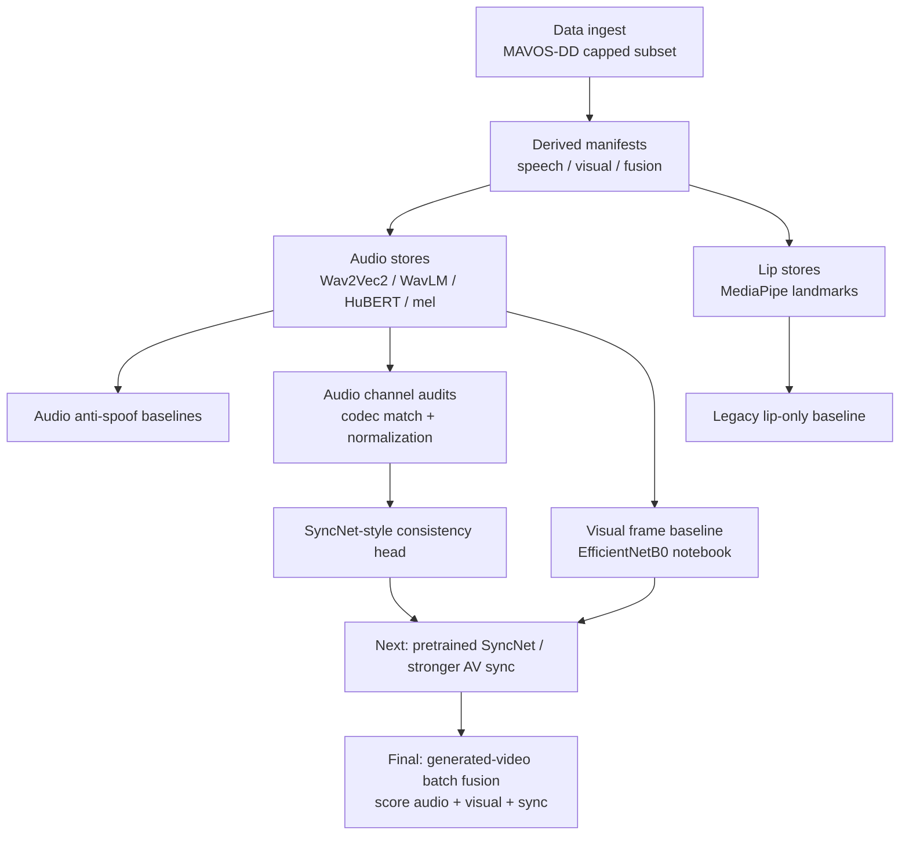

# Audiovisual Deepfake Detection

Multimodal deepfake detection on a capped MAVOS-DD subset. The project keeps
three related labels separate instead of pretending they are one thing:

| Head | Question | Positive class |
|---|---|---|
| Audio anti-spoof | Is the speech audio generated? | ElevenLabs / Google / OpenAI / other TTS |
| Visual fake-video | Is the face/video generated? | EchoMimic / MEMO / LivePortrait / Sonic |
| Audio-visual sync | Does the mouth motion match the audio? | Async / inconsistent pair |

The final detector should combine these as separate signals:

```text
deepfake_score = fusion(audio_fake_score, visual_fake_score, av_inconsistent_score)
```

That distinction matters: EchoMimic/MEMO/LivePortrait/Sonic clips usually carry
original real audio, so the audio head should not call them fake. The visual
head catches generated video, and the sync head catches mismatched audio-mouth
pairs.

Implementation details and the full working memory live in
[`CLAUDE.md`](CLAUDE.md). This README keeps only the public repro commands,
headline metrics, and current roadmap.

## Roadmap Snapshot



## Quick Start

Python 3.10 virtual environment.

macOS / Linux:

```bash
python3.10 -m venv .venv
source .venv/bin/activate
pip install -r requirements.txt
```

Windows PowerShell:

```powershell
py -3.10 -m venv .venv
.\.venv\Scripts\Activate.ps1
python -m pip install -r requirements.txt
```

Smoke-test the model module:

```bash
python -m src.models.late_fusion
```

## Repro Commands

Each step writes gitignored artifacts under `data/`. Pass `--help` to any
module for full flags. The fetch is deterministic for a fixed MAVOS-DD
repository state; cap changes are picked up from `src.common.CAPS` and the
downloader is idempotent on re-runs.

1. **Fetch the MAVOS-DD subset.**

   ```bash
   python -m src.data.download_subset
   python -m src.data.download_subset --validate    # expect VALIDATION OK
   ```

2. **Freeze splits and extract features** (70/15/15 stratified on
   `source_folder`, seed 42; one `.npy` per video for audio, one `.npz`
   for lips).

   ```bash
   python -m src.data.make_splits
   python -m src.features.extract_audio
   python -m src.features.extract_lips
   ```

3. **Transcribe bonafide WAVs** (optional, prerequisite for TTS spoof
   generation). Requires `GOOGLE_APPLICATION_CREDENTIALS` and
   `GOOGLE_CLOUD_PROJECT` in `.env`.

   ```bash
   python scripts/export_wav.py
   python scripts/transcribe_google_stt_v2.py
   ```

4. **Generate spoof audio** from those transcripts. Each script supports
   `--estimate-only` (character count, no spend) and `--limit N` (smoke
   run). Outputs land under `data/tts_audio/`.

   | Engine             | Script                                                | Notes                                  |
   |--------------------|-------------------------------------------------------|----------------------------------------|
   | ElevenLabs TTS     | `scripts/synthesize_tts_from_transcripts.py`           | Text → speech, paid API                |
   | ElevenLabs STS     | `scripts/convert_real_speech_elevenlabs.py`            | Speech → speech (preserves prosody)    |
   | Google Neural2 TTS | `scripts/synthesize_google_tts_from_transcripts.py`    | Paid API; default voice rotation       |
   | Coqui XTTS-v2      | `scripts/synthesize_coqui_xtts_from_transcripts.py`    | Local, free                            |
   | OpenAI TTS         | `scripts/synthesize_openai_tts_from_transcripts.py`    | Paid API                               |

5. **Build derived manifests** (`audio_spoof`, `visual_speech`,
   `fusion_speech`).

   ```bash
   python -m src.data.build_speech_manifests
   ```

## Anti-Leakage And Audio Audits

Two hard label leaks surfaced during the mel-CNN baseline (PR #7) and were
fixed in place: codec footprint and voice overlap. Training and evaluation
default to the codec-matched + voice-disjoint inputs; the original leaky
embeddings/splits remain on disk but are unused by the merged baselines.

**Codec footprint match.** Bonafide rows are clean 16 kHz PCM WAV; every
TTS spoof row is lossy MP3 (ElevenLabs 44.1 kHz / 128 kbps, Google TTS
24 kHz / 64 kbps). That 100 % format/label correlation lets any mel-input
model shortcut to a WAV-vs-MP3 detector. Fix: round-trip every bonafide
through MP3 (codec spec sampled per row from the spoof distribution) and
decode all rows back to 16 kHz mono WAV, so codec history becomes
label-independent. Requires `ffmpeg` + `libmp3lame` on PATH.

```bash
python -m src.data.codec_match_audio                    # writes data/audio_wav_codec_matched/ + manifest

# Re-extract from the codec-matched WAVs (the legacy stores are now stale):
for B in wav2vec2 wavlm hubert; do
  python -m src.features.extract_audio_embeddings --backend $B \
    --manifest data/derived/audio_spoof_manifest_codec_matched.csv --overwrite
done
python -m src.features.extract_mel \
  --manifest data/derived/audio_spoof_manifest_codec_matched.csv --overwrite
```

**Voice-disjoint split.** Even with codec neutralized, the same TTS voice
appeared in train, val, and test simultaneously. Fix: confine each
`(provider, voice_id_or_name)` to exactly one split.

```bash
python -m src.data.make_voice_disjoint_manifest        # data/derived/audio_spoof_manifest_voice_split.csv
python -m src.data.apply_voice_split --target data/derived/visual_speech_manifest.csv \
  --out data/derived/visual_speech_manifest_voice_split.csv
python -m src.data.apply_voice_split --target data/derived/fusion_speech_manifest.csv \
  --out data/derived/fusion_speech_manifest_voice_split.csv
```

The audio voice-split manifest's `audio_path` already points at the
codec-matched WAVs, so this single file neutralizes **both** confounders.
The `apply_voice_split` helper rewrites only the `split` column of the
visual/fusion manifests, preserving `pair_label_binary` byte-identically.

**Audio channel normalization audit.** A follow-up branch normalized the
voice-disjoint, codec-matched WAVs with silence trim, 7 kHz lowpass,
EBU R128 loudness normalization, and peak safety:

```bash
python -m src.data.normalize_audio_channel \
  --manifest data/derived/audio_spoof_manifest_voice_split.csv \
  --out-manifest data/derived/audio_spoof_manifest_normalized.csv \
  --out-dir data/derived/audio_normalized \
  --overwrite

for B in wav2vec2 wavlm hubert; do
  python -m src.features.extract_audio_embeddings --backend $B \
    --manifest data/derived/audio_spoof_manifest_normalized.csv \
    --out-dir data/features/audio_${B}_normalized
done

python -m src.features.extract_mel \
  --manifest data/derived/audio_spoof_manifest_normalized.csv \
  --out-dir data/features/audio_mel_normalized
```

The audit result is intentionally conservative: normalization reduced obvious
channel cues, but did **not** remove audio-only separability. The normalized
acoustic probe still reached LR ROC-AUC 0.9713 / RF ROC-AUC 0.9889, and the
normalized mel-CNN reached ROC-AUC 0.99994. Full details are in
[`report/audio_channel_normalization_audit.md`](report/audio_channel_normalization_audit.md).

## Validation Results

Validation-only model selection; the test split is locked for the final
consolidated pass.

### Audio Anti-Spoof

Audio labels answer only: **is the speech audio generated?** Original MAVOS-DD
audio is bonafide even when the video source is EchoMimic/MEMO/LivePortrait/
Sonic.

Honest in-distribution val ROC-AUC on the **codec-matched + voice-disjoint**
inputs:

| Modality               | wav2vec2           | wavlm              | hubert             |
|------------------------|--------------------|--------------------|--------------------|
| audio                  | 0.9508 (EER 0.106) | 1.0000 (EER 0.006) | 1.0000 (EER 0.000) |
| fusion (audio ⊕ lips)  | 0.9509 (EER 0.107) | 1.0000 (EER 0.000) | 1.0000 (EER 0.000) |
| visual (lips only)     | 0.5688 (EER 0.433) | —                  | —                  |

Train:

```bash
# Audio anti-spoof (per backend)
python -m src.train --backend {wav2vec2,wavlm,hubert} --run-name audio_<backend>_codec

# Visual + fusion
python -m src.train --modality visual --run-name visual_bigru
python -m src.train --modality fusion --backend wav2vec2 --run-name fusion_wav2vec2_codec
```

Evaluate any checkpoint on val (test refused unless `--allow-test`):

```bash
python -m src.evaluate --checkpoint models/checkpoints/best_<name>.pt --split val
```

Full per-checkpoint metric battery (roc_auc, eer, eer_threshold, f1,
precision, recall, confusion, per-provider recall) is committed at
[`report/val_eval/all_checkpoints_val_metrics.json`](report/val_eval/all_checkpoints_val_metrics.json).

### Audio Channel Normalization

The first acoustic probe showed severe channel shortcuts on the voice-disjoint
audio-spoof manifest:

| Probe | Original ROC-AUC | Normalized ROC-AUC |
|---|---:|---:|
| Logistic regression on acoustic stats | 0.9914 | 0.9713 |
| Random forest on acoustic stats | 0.9970 | 0.9889 |

Normalization used silence trim, 7 kHz lowpass, EBU R128 loudness
normalization, and peak safety on codec-matched WAVs. It reduced obvious
channel cues but did not remove separability. The normalized mel-spectrogram
notebook likewise stayed near saturated: ROC-AUC **0.99994**. The takeaway is
that generator fingerprints survive simple channel normalization. See
[`report/audio_channel_normalization_audit.md`](report/audio_channel_normalization_audit.md).

### Audio-Visual Sync

The current sync branch trains a lightweight SyncNet-style consistency head
over WavLM audio embeddings plus MediaPipe lip landmarks. Positive class is
`async_inconsistent_pair`.

| Model | Val ROC-AUC | EER | F1 | Honest read |
|---|---:|---:|---:|---|
| WavLM + BiGRU consistency head | 0.8409 | 0.2527 | 0.8261 | Strong on generated-audio negatives, weak on real-audio mismatches |

Breakdown:

| Negative type | Recall |
|---|---:|
| generated_same_transcript | 1.0000 |
| mismatched_generated | 0.9992 |
| mismatched_original | 0.4831 |

So this is not yet a true pretrained SyncNet result. It mostly catches the
synthetic-audio side of the async task. Full metrics:
[`report/val_eval/lipsync_wavlm_val.txt`](report/val_eval/lipsync_wavlm_val.txt).

### Visual Fake-Video Baseline

The revised visual notebook asks a different question from audio anti-spoof:
**real video vs generated video**.

```text
real -> 0
echomimic / memo / liveportrait / sonic -> 1
```

EfficientNetB0 frame baseline, 20 frames per video, frozen train/val split:

| Val ROC-AUC | EER | F1 | Precision | Recall |
|---:|---:|---:|---:|---:|
| 0.9853 | 0.0671 | 0.9167 | 0.8988 | 0.9352 |

Per-source result:

| Source | Metric | Value |
|---|---|---:|
| real | specificity | 0.9307 |
| echomimic | fake recall | 1.0000 |
| memo | fake recall | 1.0000 |
| liveportrait | fake recall | 0.6596 |
| sonic | fake recall | 1.0000 |

This result is useful but confounded: a codec/resolution audit found no shared
video signatures across sampled source folders, so the CNN can exploit
resolution/FPS/encoder artifacts. The notebook reports this explicitly. Summary:
[`report/visual_frame_baseline/visual_frame_baseline_efficientnet_b0_val.json`](report/visual_frame_baseline/visual_frame_baseline_efficientnet_b0_val.json).

## Known Limitations

**Per-TTS-engine spectral and channel fingerprinting.** WavLM and HuBERT
saturate at val ROC-AUC = 1.0 even after codec matching, voice-disjoint
splits, and channel normalization; Wav2Vec2 remains around 0.96. The remaining
shortcut is generator and dataset fingerprinting: every TTS engine leaves
vocoder/encoder artifacts, prosody/timbre regularities, silence structure, and
bandwidth/spectral-envelope cues that are not removed by the current
normalization pass.
The trained head is therefore closer to a *two-class TTS-engine detector*
(ElevenLabs OR Google TTS vs MAVOS-DD bonafide) than a generalized
deepfake detector — a new engine the model has not seen may evade detection.
The honest evaluation protocol is engine-disjoint / leave-one-engine-out across
multiple generators.

**Legacy lip-only visual collapse.** The old BiGRU lip-only baseline used the
same `.npz` lip features for matched bonafide and matched spoof rows of the
same source video, so its ROC-AUC 0.5688 result is structurally expected. It is
not the same task as the new visual frame baseline.

**Visual frame baseline is likely channel-confounded.** EfficientNetB0 reaches
ROC-AUC 0.9853, but source folders have distinct resolution/FPS/codec
signatures. The number is a useful baseline, not proof of semantic fake-face
generalization.

**Concat fusion ≈ audio-only.** The old late-fusion model inherits the dominant
audio score. Final fusion should combine explicit head scores:
`audio_fake_score`, `visual_fake_score`, and `av_inconsistent_score`.

## Next Branches

1. `feat/pretrained-syncnet` — replace or augment the lightweight consistency
   head with a pretrained/raw-frame SyncNet-style mouth-audio model.
2. `feat/generated-video-batch-fusion` — score the incoming fully AI-generated
   videos with the three heads and evaluate final multimodal fusion.
